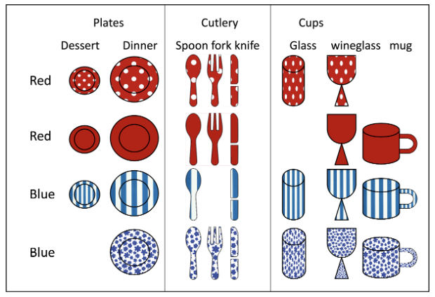

# BEGIN PROB

\[(11 points)\]

You have 4 sets of dishes each consisting of plates (dessert and
dinner), cutlery (spoon fork and knife) and cups (glass, wineglass and
mug). Two sets are red and two are blue and each set has a different
pattern: dots, solid, stripes or flowers as in the picture below.
Originally you had $4 * 8 =32$ dishes, but over the years you have lost
some of your dishes so that now you only have 28. A lost dish is
indicated by dish being missing in the image (for example you lost the
blue flowers dessert place or the red dots mug).

You come home and find a single item in the kitchen sick.

# BEGIN SUBPROB

Let $A$ be the event that the item has stripes, and let $B$ be the event
that the item is a cup (glass, wineglass or mug). Are these events
independent? *Explain your reasoning.*

::: responsebox
This question is based on the deck of cards question we did in
class.

No, they are not. Knowing that the item is a cup makes it slightly more
likely that the item has stripes.

$$P(A)=7/28$$ $$P(B)=10/28 = 5/14$$
$$P(A \cap B = 3/28 \neq (7*5)/(28*14)=5/56$$ Therefore not independent
:::

# BEGIN SOLUTION
::: responsebox
Note this question is based on Lecture 23, slides 15, 20, 21 where
we have replaced a deck of cards with patterned dishes.

In both b) and c) many made the mistake of selecting disjoint events A
and B such the $A \cap B = \emptyset$ (or $A \cap B|C = \emptyset$ in c)
) but $P(A),P(B)>0$. Mutually exclusive events with non-zero probability
are not independent (lecture 23, slide 13).
:::
# END SOLUTION

# END SUBPROB

# BEGIN SUBPROB

Regarding the identity of the item in the sink, give an example of two
events $A$ and $B$ which are *independent*. Prove that they are
independent. *To receive full credit, your events should not have
probabilities equal to zero or to one.*

# BEGIN SOLUTION

::: responsebox

There were multiple correct options here.

One strategy is based on noticing that in every row there are 7 dishes.
Therefore for any dish for which we have all 4 patterns (dinner plate,
spoon, knife, wine glass) you can select event A to be a pattern (for
example dots) and B to be one of the dishes for which we have the full
set (for example spoon). Then $$P(A) = \frac{7}{28}=\frac{1}{4}$$
$$P(B) = \frac{4}{28}=\frac{1}{7}$$
$$P(A \cap B) = \frac{1}{28} = \frac{1}{7} \cdot \frac{1}{4}$$

Also $$P(B|A) = \frac{1}{7}=P(B)$$

This can also be done for either the red or blue color (instead of a
single pattern), for example: Let A be the event that the item is red
and let B be the event that the item is a spoon. There are 14 red
dishes: $P(A)=\frac{14}{28}=\frac{1}{2}$ and there are 4 spoons:
$P(B)=\frac{4}{28}=\frac{1}{7}$. There are 2 red spoons:
$P(A,B) =\frac{2}{28}=\frac{1}{14}$.
$$P(A,B)= \frac{1}{14} =\frac{1}{7}* \frac{1}{2} =P(B)*P(A)$$
:::

# END SOLUTION

# END SUBPROB

# BEGIN SUBPROB

Regarding the identity of the item in the sink, give an example of three
events $A$, $B$, and $C$ such that $A$ and $B$ are *conditionally
independent* given $C$. Prove that they are conditionally independent.
*To receive full credit, your events should not have probabilities equal
to zero or to one.*

# BEGIN SOLUTION
::: responsebox
As in b) there are many correct solutions here (some of you were
very creative).

One strategy here is to consider the events in a) which weren't
independent and see if we can condition it on event C, so that they are.
Let $A$ be the event that the item has stripes, and let $B$ be the event
that the item is a cup (glass, wineglass or mug). Notice if we set $C$
to be the event that the item is blue, none of the blue cups are
missing.

Then, there are 3 blue striped cups: $P(A\cap B|C)= \frac{3}{14}$. There
are seven blue striped dishes $P(A|C)=\frac{7}{14}=\frac{1}{2}$ and
there are 6 blue cups: $P(B|C)=\frac{6}{14}=\frac{3}{7}$.
$$P(A\cap B|C)= \frac{3}{14} =\frac{1}{2}*\frac{3}{7}=P(A|C)*P(B|C)$$

Some other popular answers:

A = dots, B = plates, C= red (this also works for A = solid)

$$P(A|C) = \frac{7}{14}=\frac{1}{2}$$
$$P(B|C) = \frac{4}{14}=\frac{2}{7}$$ $$P(A \cap B|C) = \frac{2}{14}$$

A = stripe, B = knife, C= blue (this also works for A = flowers, and/or
B = spoon) $$P(A|C) = \frac{7}{14}=\frac{1}{2}$$
$$P(B|C) = \frac{2}{14}=\frac{1}{7}$$ $$P(A \cap B|C) = \frac{1}{14}$$

We did accept cases (with some deduction) where $$P(A |C) =0$$
$$P(B|C)>0$$ $$P(A \cap B |C) =0$$

or $$P(A |C) =1$$ $$P(B|C)>0$$ $$P(A \cap B |C) = P(B|C)$$
:::
# END SOLUTION

# END SUBPROB

# END PROB